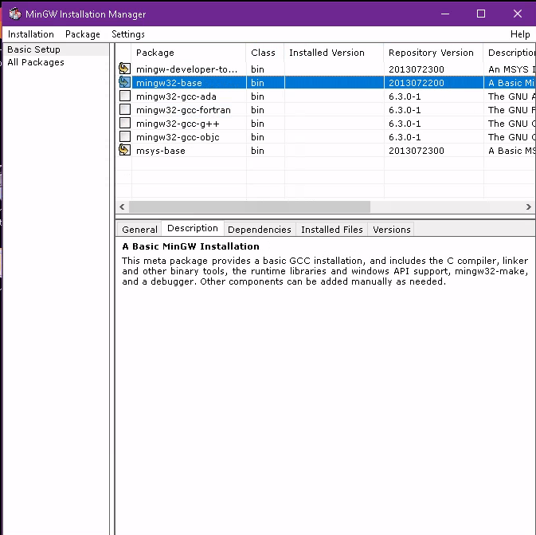
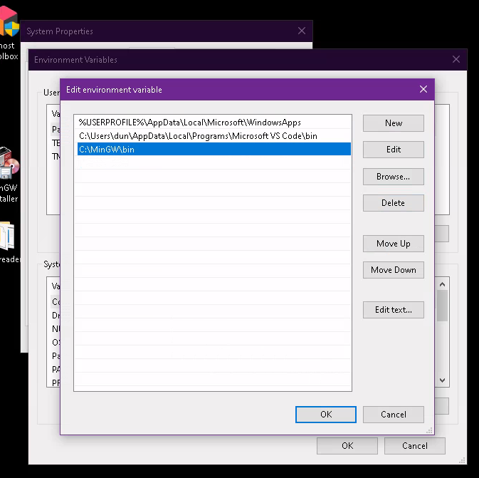
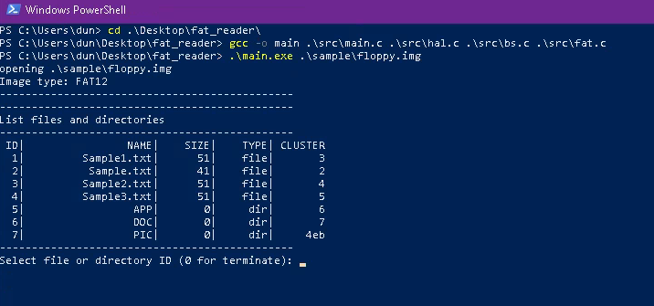

# Simple FAT reader: listing directories and files, read text files and hex dump binary files

## Usage

`./main.exe <path to image>` or `./main.exe <path to image>` on Windows.

## Build in Linux/WSL

Prerequired: `make`, `gcc`.

Runs `make main` to create main binary file or `gcc -o main src/main.c src/hal.c src/bs.c src/fat.c` without `make`.

## Build in Windows using MinGW

- Download MinGW at [Link](https://sourceforge.net/projects/mingw/files/Installer/mingw-get-setup.exe/download)
- Install MinGW:
  - Select mingw32-base package like following image, then select `Installation`->`Apply`
    
  - Add mingw binaries to Path:
    

- Build `main.exe` in PowerShell with command

``` shell
gcc -o main .\src\main.c .\src\hal.c .\src\bs.c .\src fat.c
```

- After build, we can run the `.exe` file:

